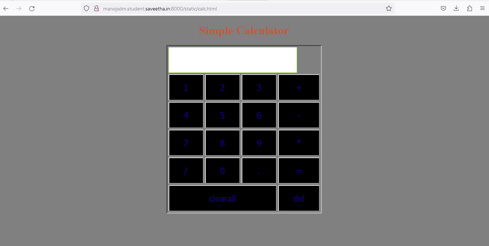

# Design of a Standard Calculator

## AIM:

To design a web application for a standard calculator.

## DESIGN STEPS:

### Step 1:
Create a new Django project using "django-admin startproject",get into the project terminal and use "python3 manage.py startapp" command.

### Step 2:
Define urls.py and views.py for the website .Allow host access and add the app name under installed

### Step 3:
Create a templates folder under the app folder followed by a folder under templates with the app name followed by html file named calculator.html

### Step 4:
Write HTML and CSS code in the file save it and run the app using python manage.py makemigrations and python manage.py migrate commands .Run the Server using "python3 manage.py runserver 0:80" command.

### Step 5:

Validate the HTML and CSS code.

### Step 6:

Publish the website in the given URL.

## PROGRAM :
```
Developed by : Manoj S
Reg no : 212222100025
```
```
<!DOCTYPE html>
<html>
    <head>
        <title>Calculator</title>
        <style type="text/css">
        body{
            background-color:grey;
        }
        table{
            background-color :grey;
            border: inset;
            margin-left: auto;
            margin-right: auto;
        }
        input[type="text"]{
            border: 1px solid rgb(182, 255, 64);
            padding: 20px 30px;
            font-size: 24px;
            font-weight: bold;
            border-radius: 2px;
            
        }


        input[type="button"]{
            color: rgb(20, 0, 136);
            width: 100%;
            padding: 20px 40px;
            background-color:black;
            border-radius: 2px;
            font-size: 24px;
        }
        </style>
    </head>
    <body>
        <form name="form1" onload="result.value=''">
            <h1 style="text-align: center;color:rgba(201, 85, 57, 0.979);">Simple Calculator</h1>
        <table id="calc">
            <tr>
                <td colspan="4">
                    <input type="text" id="result">
                </td>
            </tr>
            <tr>
                <td><input type="button" value="1" onclick="result.value+='1'"/></td>
                <td><input type="button" value="2" onclick="result.value+='2'"/></td>
                <td><input type="button" value="3" onclick="result.value+='3'"/></td>
                <td><input type="button" value="+" onclick="result.value+='+'"/></td>
            </tr>
            <tr>
                <td><input type="button" value="4" onclick="result.value+='4'"/></td>
                <td><input type="button" value="5" onclick="result.value+='5'"/></td>
                <td><input type="button" value="6" onclick="result.value+='6'"/></td>
                <td><input type="button" value="-" onclick="result.value+='-'"/></td>
            </tr>
            <tr>
                <td><input type="button" value="7" onclick="result.value+='7'"/></td>
                <td><input type="button" value="8" onclick="result.value+='8'"/></td>
                <td><input type="button" value="9" onclick="result.value+='9'"/></td>
                <td><input type="button" value="*" onclick="result.value+='*'"/></td>
            </tr>
            <tr>
                <td><input type="button" value="/" onclick="result.value+='/'"/></td>
                <td><input type="button" value="0" onclick="result.value+='0'"/></td>
                <td><input type="button" value="." onclick="result.value+='.'"/></td>
                <td><input type="button" value="=" onclick="result.value=eval(result.value)"/></td>
            </tr>
            <tr>
                <td colspan="3">
                    <input type="button" value="clearall" id="clear" onclick="result.value=''">
                </td>
                <td><input type="button" value="del" onclick="result.value=result.value.substr(0,result.value.length-1)"/></td>
            </tr>
        </table>
        </form>
    </body>
</html>
```

## OUTPUT:

## Result:

Thus we designed a web application for a standard calculator.